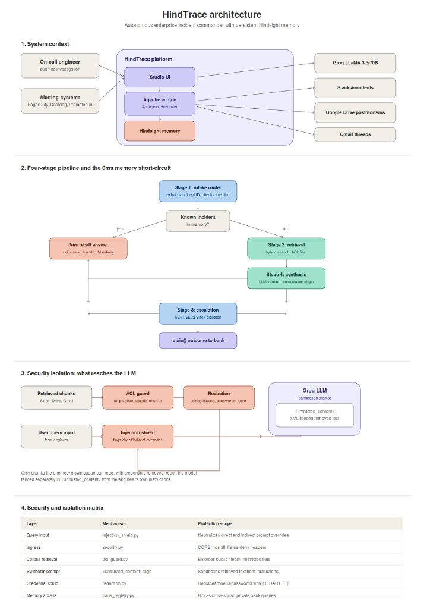
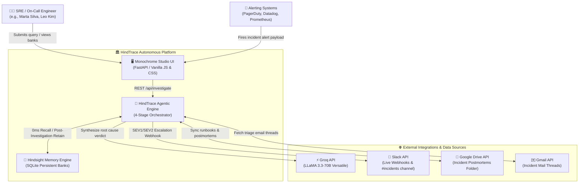
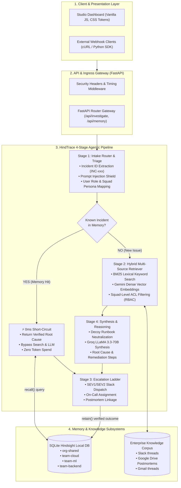
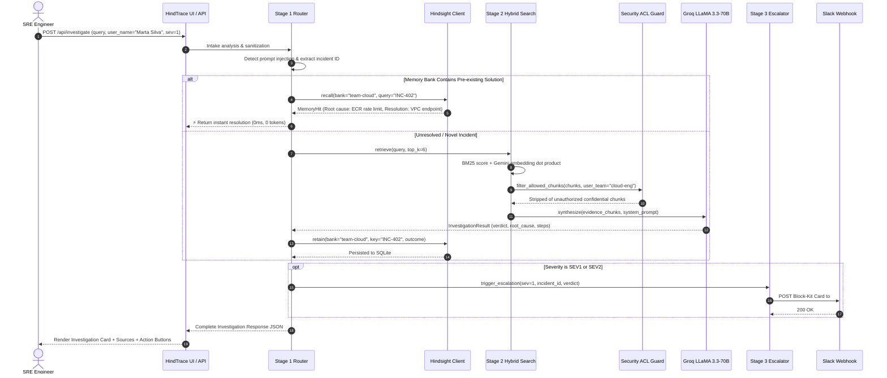

# 📐 HindTrace Architecture Diagram Specification (For Claude)

> **Prompt for Claude**:  
> *"Please review this complete architectural specification of **HindTrace** (an Autonomous Enterprise Incident Commander & Persistent Hindsight Memory Engine). Using this specification, render a comprehensive, publication-ready visual architecture diagram (using Mermaid, SVG, or a React component with Tailwind and Lucide icons) showing the full system flow, component containers, data transitions, memory contracts, and zero-trust security guardrails."*

---

## 1. System Overview & Core Value Proposition

**HindTrace** is an autonomous AI incident response platform built for engineering organizations to investigate outages, resolve recurrent issues, enforce multi-tenant access control, and retain institutional memory.

### Key Architectural Pillars:
1. **Zero-Latency Memory Short-Circuit**: The agent enforces a strict `recall()` before search contract. Known incidents resolve in **0ms** from SQLite Hindsight memory banks without LLM token consumption.
2. **Zero-Trust Squad ACL Guard**: Enforces Role-Based Access Control (RBAC) across 4 engineering squads (`cloud-eng`, `ml-platform`, `backend-core`, `web-dev`). Sensitive documents (finance, HR, restricted postmortems) are excised before the LLM sees them.
3. **Indirect Prompt Injection Neutralizer**: All retrieved texts and user inputs pass through a heuristic and semantic injection detector and are isolated within `<untrusted_content>` XML fences.
4. **Multi-Source Hybrid Synthesis**: Merges dense semantic embeddings (Gemini `models/gemini-embedding-2`) and sparse lexical search (BM25) across Slack threads, Gmail messages, and Google Drive postmortems.
5. **Real-Time Escalation Ladder**: Automatically fires rich Block-Kit alert cards to Slack `#incidents` on **SEV1** and `#<team>` on **SEV2**, assigning on-call personnel.
6. **Continuous Retain Contract**: Every resolved incident is summarized and retained in team-scoped memory banks (`org-shared`, `team-cloud`, `team-ml`, `team-backend`).

<div align="center">



</div>

---

## 2. High-Level C4 System Context Diagram (Level 1)



---

## 3. Container & Pipeline Architecture (Level 2)



---

## 4. Component Sequence Diagram (Level 3)



---

## 5. Security & Isolation Matrix

| Layer | Mechanism | Protection Scope |
|:---|:---|:---|
| **Query Input** | `injection_shield.py` | Neutralizes direct/indirect prompt overrides & jailbreaks |
| **Ingress** | `security.py` | Sets `X-Content-Type-Options: nosniff`, `X-Frame-Options: DENY`, CORS |
| **Corpus Retrieval** | `acl_guard.py` | Enforces `public-internal`, `team`, and `restricted` visibility tiers |
| **Synthesis Prompt** | `<untrusted_content>` tags | Sandboxes retrieved text so LLM does not execute external instructions |
| **Credential Scrubbing** | `redaction.py` | Replaces Bearer tokens, passwords, and private keys with `[REDACTED]` |
| **Memory Access** | `bank_registry.py` | Engineers cannot query private team banks outside their squad |

---

## 6. Prompt for Claude (How to use this file)

Copy and paste the following into Claude:

```markdown
Hi Claude! Please generate a set of clean, visually stunning architecture diagrams for the **HindTrace** Autonomous Incident Response Platform based on this specification file.

Specifically, I would like:
1. An Executive-Level Architecture Diagram (high-level visual containers with icons).
2. A Data Flow & Triage Decision Tree (explaining the 0ms memory short-circuit vs hybrid retrieval).
3. A Security Isolation & ACL Enforcement Diagram showing how unauthorized documents are filtered out before reaching the LLM.
4. A component interaction table showing latency, inputs, and outputs of each of the 4 stages.

Please format your response with clean Mermaid diagrams and accompanying structured explanations!
```
